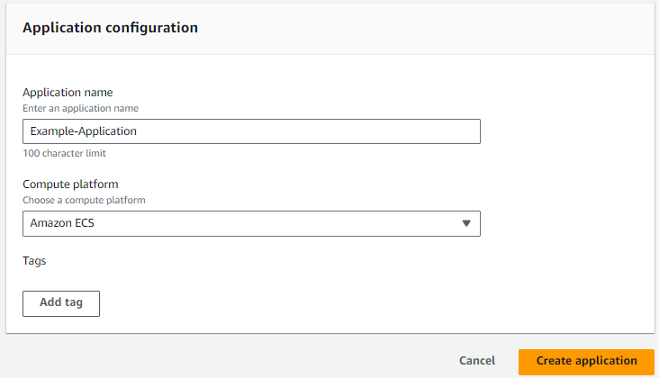
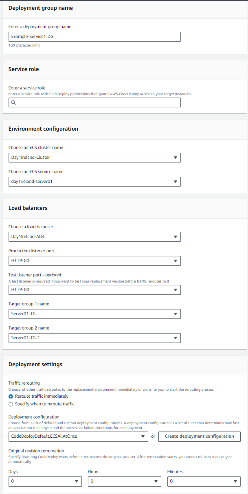

# CodePipeline
Prerequisites:

- ECS
- ECR
- Essentially everything you need for ECS stuff.

Example appspec.yaml:
```
version: 0.0
Resources:
  - TargetService:
      Type: AWS::ECS::Service
      Properties:
        TaskDefinition: <TASK_DEFINITION>
        LoadBalancerInfo:
          ContainerName: "day1ireland-server01"
          ContainerPort: 80
```
Example taskdef.json:
```
{
    "taskDefinitionArn": "arn:aws:ecs:us-east-1:xxxxxxxxxxxx:task-definition/day1ireland-server01:4",
    "containerDefinitions": [
        {
            "name": "day1ireland-server01",
            "image": "<IMAGE1_NAME>",
            "cpu": 0,
            "portMappings": [
                {
                    "name": "day1ie-server01-80-tcp",
                    "containerPort": 80,
                    "hostPort": 80,
                    "protocol": "tcp"
                }
            ],
            "essential": true,
            "environment": [],
            "mountPoints": [],
            "volumesFrom": [],
            "logConfiguration": {
                "logDriver": "awslogs",
                "options": {
                    "awslogs-group": "/ecs/day1ireland-server01",
                    "mode": "non-blocking",
                    "awslogs-create-group": "true",
                    "max-buffer-size": "25m",
                    "awslogs-region": "us-east-1",
                    "awslogs-stream-prefix": "ecs"
                },
                "secretOptions": []
            },
            "systemControls": []
        }
    ],
    "family": "day1ireland-server01",
    "executionRoleArn": "arn:aws:iam::xxxxxxxxxxxx:role/ecsTaskExecutionRole",
    "networkMode": "awsvpc",
    "revision": 2,
    "volumes": [],
    "status": "ACTIVE",
    "requiresAttributes": [
        {
            "name": "com.amazonaws.ecs.capability.logging-driver.awslogs"
        },
        {
            "name": "ecs.capability.execution-role-awslogs"
        },
        {
            "name": "com.amazonaws.ecs.capability.ecr-auth"
        },
        {
            "name": "com.amazonaws.ecs.capability.docker-remote-api.1.19"
        },
        {
            "name": "com.amazonaws.ecs.capability.docker-remote-api.1.28"
        },
        {
            "name": "ecs.capability.execution-role-ecr-pull"
        },
        {
            "name": "com.amazonaws.ecs.capability.docker-remote-api.1.18"
        },
        {
            "name": "ecs.capability.task-eni"
        },
        {
            "name": "com.amazonaws.ecs.capability.docker-remote-api.1.29"
        }
    ],
    "placementConstraints": [],
    "compatibilities": [
        "EC2",
        "FARGATE"
    ],
    "requiresCompatibilities": [
        "FARGATE"
    ],
    "cpu": "2048",
    "memory": "4096",
    "registeredAt": "2024-08-27T19:44:09.362Z",
    "registeredBy": "arn:aws:iam::xxxxxxxxxxxx:user/aedwards"
}
```

# Create CodeDeploy Application & Deployment Groups
Step 1:



Step 2 (Create as many for each service):

