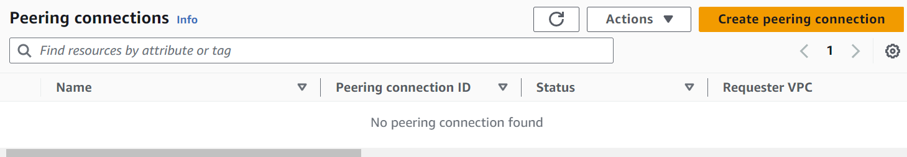
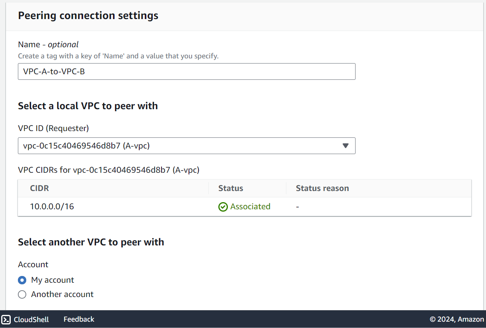
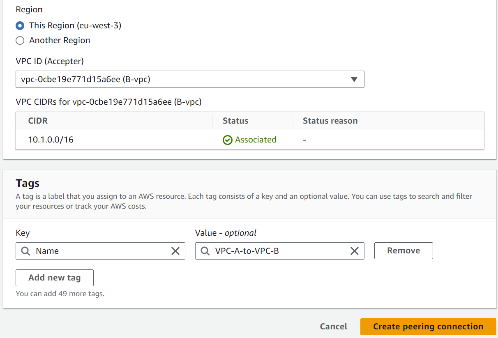
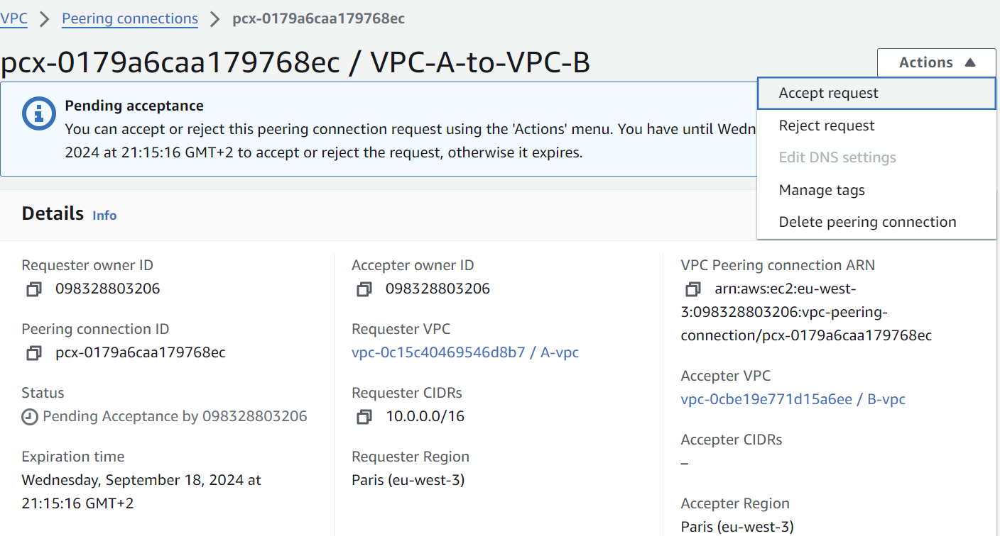
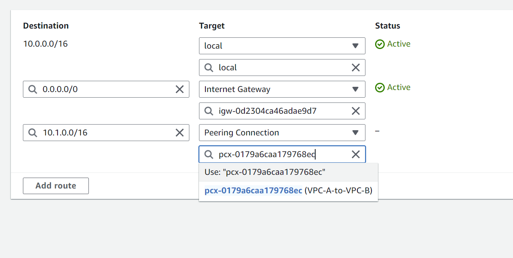
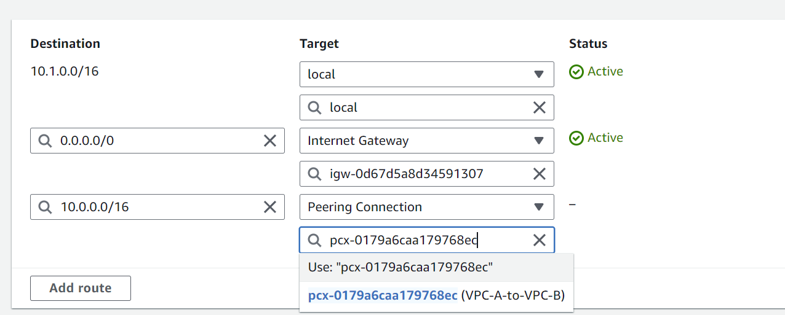
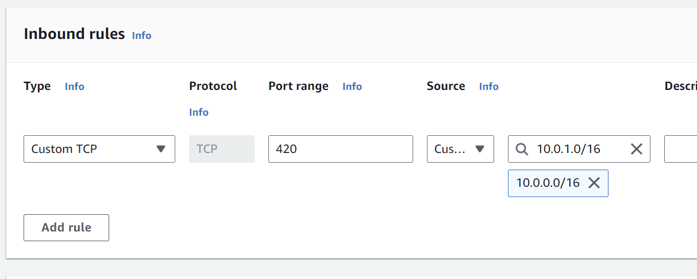

## Step 1: Create Peering Connection

Click on ```Create peering connection``` in order to start the wizard.




Fill out the wizard like shown above, and then accept the peering connection as soon as the wizard is complete.



## Step 2: Fix routes to allow for VPC-VPC communication
For each VPC, change their route tables (pub, or private, depending on the needs and requirements) as shown below.

```VPC A```:

```VPC B```


## Step 3: Ensure that Security Groups allow Traffic
Depending on the service, add the ports, and the CIDR block that is peering with the incoming VPC that has the service available, like shown:


Once complete, you should be able to peer with VPC.